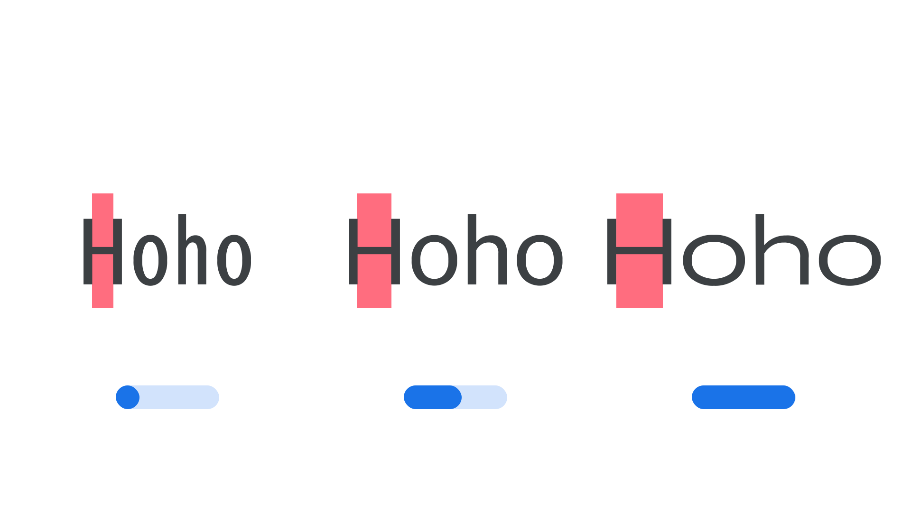

“Parametric Counter Width” (`XTRA` in CSS) is a [parametric axis](/glossary/TERM), found in some [variable fonts](/glossary/TERM), that varies counter widths in the X dimension. It can be used for fine-tuning [justification](/glossary/TERM) (as demonstrated in [TypeNetwork’s example](/glossary/TERM)) by affecting the number of [characters](/glossary/TERM) per line.

The [Google Fonts CSS v2 API ](https://developers.google.com/fonts/docs/css2) defines the axis as:

| Default: | Min: | Max: | Step: |
| --- | --- | --- | --- |
| 400 | -1000 | 2000 | 0 |

<figure>

</figure>

Its four-letter abbreviation, XTRA, is a reference to its logical name, “X-Transparent,” which describes how it alters a font’s  transparent spaces (also known as negative shapes) inside and around all [glyphs](/glossary/TERM) along the X dimension. (In pre-digital type, many of the spaces that this axis controls were known as counters.) For example, it can widen or narrow the space inside an “H” between the two stems—without changing the stroke weights of the “H,” or any vertical alignments or spaces. This isolated change is what makes it a parametric axis and different to the [Width](/glossary/TERM) axis.

In line with the current CSS spec, the four-character code for this axis should be referenced in UPPERCASE (only the five axes registered in the OpenType format specification should appear in lowercase). Also, when using the Google Fonts API, the uppercase axes have to appear first in the URL.
