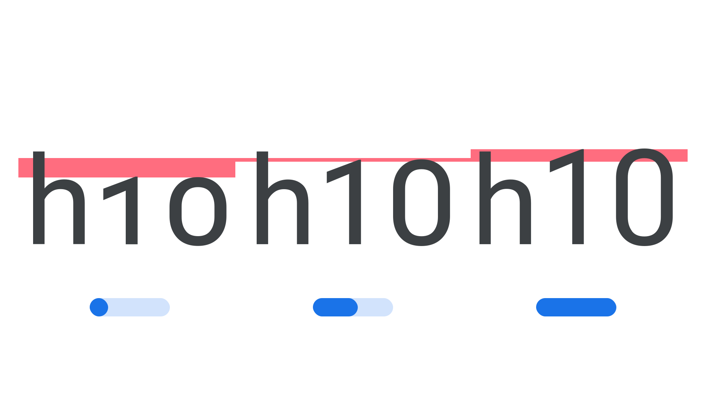

“Parametric Figure Height” (YTFI in CSS) is a parametric axis, found in some variable fonts, for specifying and varying the height of figures by varying their counterforms.

The [Google Fonts CSS v2 API ](https://developers.google.com/fonts/docs/css2) defines the axis as:

| Default: | Min: | Max: | Step: |
| --- | --- | --- | --- |
| 600 | -1000 | 2000 | 0 |
<figure>

</figure>

Its four-letter abbreviation, YTFI, is a reference to its logical name, “Y-Transparency for Figures”. It may be used in conjunction with other axes controlling Y-Transparencies (vertical alignment zones).

In line with the current CSS spec, the four-character code for this axis should be referenced in UPPERCASE (only the five axes registered in the OpenType format specification should appear in lowercase). Also, when using the Google Fonts API, the uppercase axes have to appear first in the URL.
